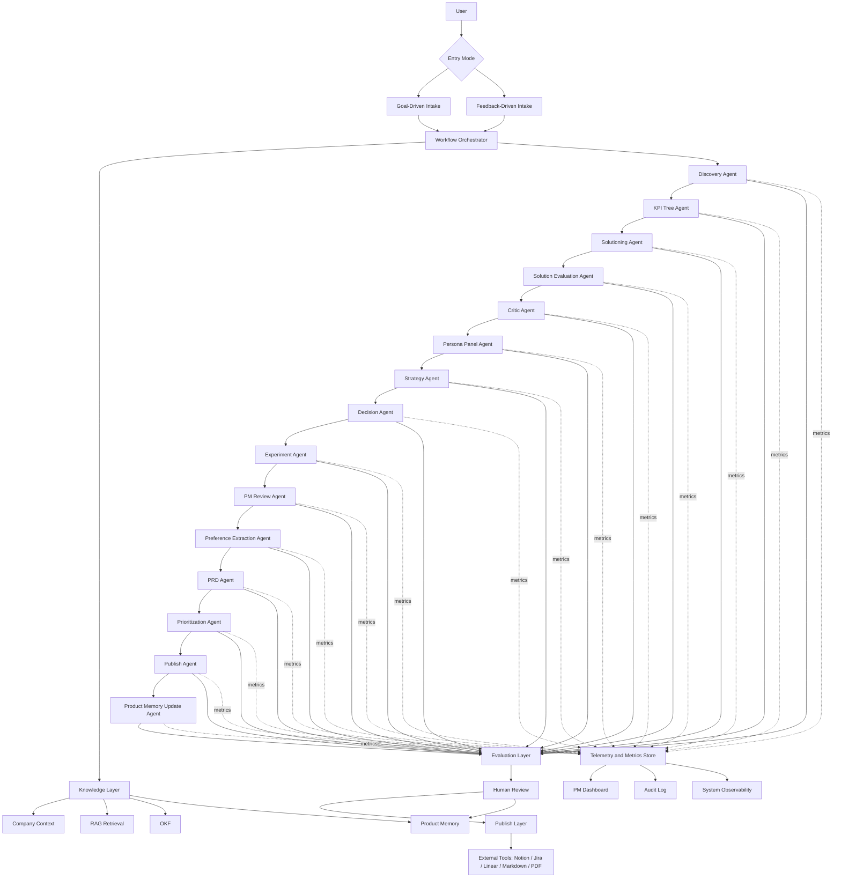

# ProductPilot AI - Agent Contracts, Metrics, and Architecture

**Purpose:** Define every agent's input and output format, evaluation gates, metrics, and the system architecture that ties them together.

**Audience:** Product, Engineering, AI Engineering, Design, and Operations.

**Scope:** This document is the implementation-facing companion to the PRD. It specifies the runtime contracts for the ProductPilot workflow, the metrics computed at every stage, and the product-management metrics that should be tracked end to end.

---

# 1. What This Document Covers

This document answers four questions:

1. What does every agent receive as input?
2. What does every agent produce as output?
3. How is each output evaluated before progression?
4. Which metrics should be tracked at each stage and at the PM level?

It also includes a system architecture diagram showing how the workflow, knowledge layer, evaluation layer, review layer, and telemetry layer fit together.

---

# 2. System-Wide Architecture

## 2.1 Architecture Diagram



## 2.2 Reading The Diagram

- The user starts a workflow from either goal-driven or feedback-driven intake.
- The workflow orchestrator owns state, retries, and stage sequencing.
- The knowledge layer supplies grounding to each agent.
- Each agent emits structured output and metrics.
- The evaluation layer scores each output before it can progress.
- Human review acts as the approval gate for publish and memory updates.
- Telemetry is emitted at every stage into the PM dashboard, audit log, and observability stack.

---

# 3. Canonical Workflow Contract

Every agent and stage should follow a shared contract so the system remains consistent.

## 3.1 Canonical Input Envelope

All agents receive a structured input envelope with these common fields:

```json
{
  "workflow_id": "wf_123",
  "tenant_id": "tenant_123",
  "project_id": "proj_123",
  "stage_id": "stage_discovery",
  "agent_name": "DiscoveryAgent",
  "entry_mode": "goal_driven",
  "user_intent": {
    "goal": "Increase activation in the first 7 days",
    "feedback_summary": null
  },
  "context": {
    "company_context_refs": ["doc_1", "doc_2"],
    "prior_stage_refs": ["art_1"],
    "retrieval_refs": ["rag_1", "rag_2"],
    "memory_refs": ["mem_1"]
  },
  "instructions": {
    "task": "frame the problem",
    "constraints": ["stay grounded", "cite evidence", "do not invent metrics"]
  },
  "budgets": {
    "token_budget": 4000,
    "latency_budget_ms": 120000,
    "retry_count": 0
  },
  "policy": {
    "approval_required": true,
    "can_write_memory": false,
    "can_publish": false
  }
}
```

## 3.2 Canonical Output Envelope

All agents should return a common output envelope:

```json
{
  "workflow_id": "wf_123",
  "stage_id": "stage_discovery",
  "agent_name": "DiscoveryAgent",
  "status": "success",
  "summary": "The core problem is low activation due to unclear onboarding value.",
  "structured_output": {},
  "citations": [
    {
      "source_id": "rag_1",
      "claim": "Users are confused in the first session.",
      "confidence": 0.84
    }
  ],
  "assumptions": [
    "Activation is currently measured by completed setup."
  ],
  "open_questions": [
    "Is activation defined by setup or first value event?"
  ],
  "warnings": [],
  "errors": [],
  "metrics": {},
  "evaluation": {},
  "next_action": "continue_to_kpi_tree",
  "artifact_ref": "art_123",
  "version": "v1"
}
```

## 3.3 Required Metadata On Every Stage

- Workflow identifier
- Stage identifier
- Agent name
- Version
- Status
- Timestamp
- Source references
- Approval state
- Retry count
- Latency
- Token usage
- Evaluation summary

---

# 4. Evaluation Framework

Every stage should be evaluated using a shared evaluation envelope.

## 4.1 Evaluation Output Envelope

```json
{
  "schema_valid": true,
  "citation_coverage": 0.9,
  "citation_quality": 0.86,
  "hallucination_risk": 0.12,
  "completeness": 0.88,
  "consistency": 0.91,
  "instruction_following": 0.95,
  "confidence_calibration": 0.8,
  "business_logic_score": 0.87,
  "overall_score": 0.88,
  "decision": "pass",
  "reasons": [
    "All required fields present",
    "Claims are grounded in internal sources"
  ],
  "required_actions": [],
  "retry_recommended": false,
  "human_review_required": true
}
```

## 4.2 Default Gate Policy

Suggested starting thresholds:

- `schema_valid` must be `true`
- `citation_coverage` should be at least `0.70`
- `hallucination_risk` should be at most `0.30`
- `completeness` should be at least `0.75`
- `consistency` should be at least `0.80`
- `instruction_following` should be at least `0.90`
- `business_logic_score` should be at least `0.75`

These thresholds should be configurable by tenant and stage.

## 4.3 Evaluation Types

### Structural Evaluation

- JSON schema validation
- Required field validation
- Type checking

### Grounding Evaluation

- Citation presence
- Source coverage
- Claim-to-source mapping
- Freshness and trust checks

### Reasoning Evaluation

- Internal consistency
- Logical coherence
- Assumption clarity
- Trade-off completeness

### Risk Evaluation

- Hallucination risk
- Policy risk
- Ambiguity risk
- Downstream blast radius

### Human Readiness Evaluation

- Is the output reviewable?
- Does the user have enough context to approve or edit?
- Are there unresolved conflicts?

---

# 5. Stage Metrics Model

Every stage should emit metrics in five categories.

## 5.1 Input Metrics

How strong was the input to the stage?

- Input completeness
- Input clarity
- Input ambiguity score
- Input noise score
- Source freshness
- Source diversity
- Retrieval coverage

## 5.2 Output Metrics

How strong was the generated output?

- Output completeness
- Output confidence
- Output novelty
- Output consistency
- Output actionability
- Output readability

## 5.3 Evaluation Metrics

How strong was the evaluation result?

- Schema pass/fail
- Citation coverage
- Hallucination risk
- Business logic score
- Retry necessity
- Human review necessity

## 5.4 Operational Metrics

How expensive or slow was the stage?

- Latency
- Token usage
- Retry count
- Cost estimate
- Error count
- Queue wait time

## 5.5 Product Metrics

How does this stage affect PM outcomes?

- Time saved
- Decision confidence
- Edit burden
- Approval rate
- Reuse rate
- Adoption rate

---

# 6. PM Dashboard Metrics Catalog

These are the metrics that should be tracked from a product management perspective across the whole workflow.

| Metric | Definition | Why It Matters | Level |
|---|---|---|---|
| Time to first draft | Time from workflow start to first usable artifact | Measures speed to value | Product |
| Time to approved PRD | Time from workflow start to approved PRD | Core efficiency metric | Product |
| First-pass approval rate | Percent of outputs approved without major rewrite | Measures output quality | Product |
| Revision count | Number of human edit cycles per workflow | Measures friction | Product |
| Edit burden | Human edit volume relative to AI output size | Measures usefulness of draft | Product |
| Recommendation acceptance rate | Percent of recommendations accepted by PMs | Measures decision trust | Product |
| PRD reuse rate | Percent of generated PRDs used downstream | Measures practical value | Product |
| Workflow completion rate | Percent of workflows that reach completion | Measures reliability | Product |
| Stage failure rate | Failure frequency per stage | Identifies weak points | Product/Eng |
| Retry rate | Percent of stages retried | Measures output stability | Product/Eng |
| Citation coverage | Percent of factual claims grounded in sources | Measures trustworthiness | Product/AI |
| Citation quality | Source relevance, freshness, and trust score | Measures evidence quality | Product/AI |
| Hallucination rate | Percent of outputs with unsupported claims | Measures AI risk | Product/AI |
| Confidence calibration | Match between confidence score and actual quality | Measures model honesty | Product/AI |
| Completeness score | How fully required sections are covered | Measures readiness | Product |
| Consistency score | Internal consistency across stages | Measures coherence | Product/AI |
| Business logic score | Alignment with goals, constraints, and strategy | Measures decision quality | Product |
| Approval latency | Time spent waiting for human approval | Measures review throughput | Product/Ops |
| Publish success rate | Percent of publish actions that succeed | Measures delivery reliability | Product/Ops |
| Memory acceptance rate | Percent of proposed memory updates approved | Measures learning quality | Product |
| Memory reuse rate | How often memory influences future runs | Measures personalization value | Product |
| Cost per workflow | End-to-end AI and infra cost | Measures efficiency | Product/Ops |
| Cost per approved PRD | Cost normalized by approved output | Measures unit economics | Product/Ops |
| PM satisfaction score | User-reported usefulness and trust | Measures adoption | Product |
| Team adoption rate | Percent of active PMs using the system | Measures product-market fit | Product |

---

# 7. Stage-by-Stage Metrics

This section defines the metrics that should be calculated at every step of the pipeline.

## 7.1 Intake Stage

### Calculated Metrics

- Intake completeness
- Intake clarity
- Missing field count
- Ambiguity score
- Source attachment count
- Feedback volume
- Feedback duplication rate

### PM Importance

- Indicates whether the workflow started with enough information
- Predicts downstream friction

## 7.2 Retrieval Stage

### Calculated Metrics

- Retrieval recall proxy
- Retrieval precision proxy
- Source freshness
- Source trust score
- Source diversity
- Evidence coverage
- Relevance score

### PM Importance

- Measures whether the system is grounding itself in the right evidence

## 7.3 Discovery Stage

### Calculated Metrics

- Problem clarity score
- Assumption count
- Assumption quality score
- Scope precision
- Root-cause confidence
- Evidence-to-claim ratio

### PM Importance

- Determines whether the team is solving the right problem

## 7.4 KPI Tree Stage

### Calculated Metrics

- KPI completeness
- Metric measurability score
- North Star alignment
- Guardrail coverage
- Vanity metric avoidance score
- Metric dependency clarity

### PM Importance

- Ensures the initiative is measurable and trackable

## 7.5 Solutioning Stage

### Calculated Metrics

- Solution count
- Solution diversity score
- Feasibility score
- Constraint coverage
- Trade-off richness
- Evidence linkage score

### PM Importance

- Measures breadth and quality of options

## 7.6 Solution Evaluation Stage

### Calculated Metrics

- Impact score
- Effort score
- Risk score
- Confidence score
- Weighted decision score
- Sensitivity score

### PM Importance

- Helps choose between options with discipline

## 7.7 Critic Stage

### Calculated Metrics

- Gap count
- Contradiction count
- Uncertainty count
- Risk exposure score
- Critique coverage

### PM Importance

- Exposes failure modes before commitment

## 7.8 Persona Panel Stage

### Calculated Metrics

- Persona disagreement score
- Objection count
- Adoption risk score
- Persona coverage
- Stakeholder tension score

### PM Importance

- Reveals who may resist the proposal

## 7.9 Strategy Stage

### Calculated Metrics

- Strategic fit score
- OKR alignment score
- Roadmap alignment score
- Sequencing score
- Portfolio fit score

### PM Importance

- Confirms the initiative belongs in the plan

## 7.10 Decision Stage

### Calculated Metrics

- Decision confidence
- Decision clarity
- Alternative coverage
- Trade-off completeness
- Recommendation strength

### PM Importance

- Makes the final recommendation defensible

## 7.11 Experiment Stage

### Calculated Metrics

- Hypothesis clarity
- Testability score
- Instrumentation completeness
- Success criteria clarity
- Experiment confidence

### PM Importance

- Determines whether the recommendation can be validated

## 7.12 PM Review Stage

### Calculated Metrics

- Review readiness
- Editable completeness
- Comment density
- Human correction count
- Review turnaround time

### PM Importance

- Measures how easy the output is to review and finalize

## 7.13 Preference Extraction Stage

### Calculated Metrics

- Preference confidence
- Preference stability
- Approved edit coverage
- Signal-to-noise ratio

### PM Importance

- Tracks whether the system is learning useful style and structure preferences

## 7.14 PRD Stage

### Calculated Metrics

- PRD completeness
- Requirement clarity
- Scope clarity
- Dependency clarity
- Traceability score
- Readability score

### PM Importance

- Measures whether the document is publishable

## 7.15 Prioritization Stage

### Calculated Metrics

- Score completeness
- Priority confidence
- Sensitivity to assumptions
- Framework consistency
- Ranking clarity

### PM Importance

- Measures whether prioritization is credible

## 7.16 Publish Stage

### Calculated Metrics

- Publish success rate
- Destination availability
- Export latency
- Artifact fidelity
- Formatting integrity

### PM Importance

- Measures whether the final artifact reached the right place without loss

## 7.17 Memory Update Stage

### Calculated Metrics

- Memory candidate quality
- Approval rate
- Provenance completeness
- Memory utility score
- Memory reuse rate

### PM Importance

- Measures whether the organization is actually learning

---

# 8. Agent Contracts

Each agent below includes:

- Purpose
- Input format
- Output format
- Evaluation rules
- Metrics calculated
- Failure modes
- Retry policy
- PM value

## 8.1 Discovery Agent

### Purpose

Convert a goal or feedback cluster into a crisp problem statement with assumptions and open questions.

### Input Format

Required fields:

- `workflow_id`
- `entry_mode`
- `user_intent.goal` or `user_intent.feedback_summary`
- `company_context_refs`
- `retrieval_refs`
- `instructions.task`

Useful optional fields:

- `target_segment`
- `timeline`
- `constraints`
- `stakeholders`

### Output Format

Required output fields:

- `problem_statement`
- `why_now`
- `problem_scope`
- `key_assumptions`
- `open_questions`
- `success_definition`
- `evidence_map`

Example output structure:

```json
{
  "problem_statement": "Users do not reach first value quickly enough.",
  "why_now": "Activation is suppressing expansion opportunity.",
  "problem_scope": {
    "in_scope": ["onboarding flow", "first value event"],
    "out_of_scope": ["pricing changes", "platform migration"]
  },
  "key_assumptions": ["Activation is the main bottleneck"],
  "open_questions": ["Which event defines activation?"],
  "success_definition": "Improve activation within 7 days by 15 percent",
  "evidence_map": [
    {
      "claim": "Users drop before first value",
      "source_id": "rag_1"
    }
  ]
}
```

### Evaluation Rules

- Must clearly distinguish symptoms from root causes
- Must cite evidence for core claims
- Must not invent the problem definition without grounding

### Metrics Calculated

- Problem clarity score
- Scope precision
- Assumption quality
- Evidence-to-claim ratio
- Root-cause confidence

### Failure Modes

- Overbroad framing
- Unsupported assumptions
- Noisy or contradictory problem statement

### Retry Policy

- Retry if evidence is insufficient or framing is ambiguous
- Do not retry if the input itself is too vague without human clarification

### PM Value

- Defines the actual work to be done

## 8.2 KPI Tree Agent

### Purpose

Translate the problem into measurable outcomes, with a North Star Metric and supporting metrics.

### Input Format

Required fields:

- `problem_statement`
- `business_goal`
- `company_context_refs`
- `retrieval_refs`
- `instructions.task`

### Output Format

Required output fields:

- `north_star_metric`
- `input_metrics`
- `guardrail_metrics`
- `metric_definitions`
- `metric_dependencies`
- `measurement_gaps`

Example output structure:

```json
{
  "north_star_metric": {
    "name": "Weekly activated users",
    "definition": "Users who complete first value within 7 days"
  },
  "input_metrics": [
    {"name": "onboarding completion rate", "definition": "Percent who finish setup"}
  ],
  "guardrail_metrics": [
    {"name": "support ticket volume", "definition": "Tickets per active user"}
  ],
  "metric_definitions": [
    {"name": "first value", "definition": "The first meaningful outcome event"}
  ],
  "metric_dependencies": [
    "Event tracking must exist for activation funnel"
  ],
  "measurement_gaps": [
    "No current definition for first value"
  ]
}
```

### Evaluation Rules

- Metrics must be measurable
- Metrics must map to business outcomes
- Vanity metrics should be avoided

### Metrics Calculated

- KPI completeness
- Measurability score
- Guardrail coverage
- North Star alignment
- Metric dependency clarity

### Failure Modes

- Metrics are too vague
- Metrics are not instrumentable
- Metrics do not connect to the business goal

### Retry Policy

- Retry only if additional context or definitions are available

### PM Value

- Gives the team a measurable target and guardrails

## 8.3 Solutioning Agent

### Purpose

Generate multiple solution options that address the problem under the given constraints.

### Input Format

Required fields:

- `problem_statement`
- `kpi_tree`
- `constraints`
- `retrieval_refs`
- `okf_refs`

### Output Format

Required output fields:

- `solution_options`
- `option_summary`
- `trade_offs`
- `dependencies`
- `expected_impact`
- `implementation_notes`

### Evaluation Rules

- Must produce distinct options
- Must not duplicate variants
- Must tie each option to evidence or constraints

### Metrics Calculated

- Option count
- Option diversity score
- Constraint coverage
- Evidence linkage score
- Feasibility score

### Failure Modes

- Too few options
- Near-duplicate options
- Options detached from constraints

### Retry Policy

- Retry if options are shallow or too similar

### PM Value

- Expands the solution space before narrowing down

## 8.4 Solution Evaluation Agent

### Purpose

Score candidate solutions using impact, effort, risk, and confidence.

### Input Format

Required fields:

- `solution_options`
- `metric_definitions`
- `constraints`
- `retrieval_refs`

### Output Format

Required output fields:

- `scores`
- `ranked_options`
- `scoring_rationale`
- `sensitivity_notes`
- `recommendation_summary`

### Evaluation Rules

- Scores must be explainable
- Must include trade-offs
- Must explain score drivers

### Metrics Calculated

- Impact score
- Effort score
- Risk score
- Confidence score
- Weighted score

### Failure Modes

- Unclear scoring
- Unjustified rankings

### Retry Policy

- Retry if scoring is inconsistent or incomplete

### PM Value

- Creates a defensible decision model

## 8.5 Critic Agent

### Purpose

Stress test the work so far and find blind spots.

### Input Format

Required fields:

- `prior_outputs`
- `solution_evaluation`
- `constraints`

### Output Format

Required output fields:

- `risks`
- `missing_assumptions`
- `contradictions`
- `unanswered_questions`
- `recommendations`

### Evaluation Rules

- Must be adversarial but constructive
- Must focus on failure modes, not style

### Metrics Calculated

- Gap count
- Contradiction count
- Risk exposure score
- Critique coverage

### Failure Modes

- Too vague
- Too polite
- Repeats prior content without adding risk insight

### Retry Policy

- Retry if the critique is shallow

### PM Value

- Prevents premature lock-in

## 8.6 Persona Panel Agent

### Purpose

Simulate how different stakeholders are likely to react.

### Input Format

Required fields:

- `solution_options`
- `decision_summary`
- `stakeholder_list`

### Output Format

Required output fields:

- `persona_feedback`
- `persona_objections`
- `persona_adoption_risk`
- `persona_support_level`

### Evaluation Rules

- Each persona should be meaningfully distinct
- Feedback should reflect the persona's priorities

### Metrics Calculated

- Persona disagreement score
- Objection count
- Adoption risk score
- Persona coverage

### Failure Modes

- Generic reactions
- Missing stakeholder perspective

### Retry Policy

- Retry if personas are too similar or too generic

### PM Value

- Surfaces adoption issues early

## 8.7 Strategy Agent

### Purpose

Evaluate strategic alignment with roadmap, OKRs, and company direction.

### Input Format

Required fields:

- `solution_summary`
- `roadmap_refs`
- `okr_refs`
- `company_context_refs`

### Output Format

Required output fields:

- `strategic_fit`
- `roadmap_alignment`
- `okr_alignment`
- `sequencing_guidance`
- `strategic_risks`

### Evaluation Rules

- Must explain strategic alignment in plain language
- Must identify if the initiative is poorly timed

### Metrics Calculated

- Strategic fit score
- OKR alignment score
- Roadmap alignment score
- Sequencing score

### Failure Modes

- Misreads roadmap priorities
- Too generic

### Retry Policy

- Retry only if roadmap or OKR inputs change

### PM Value

- Keeps the initiative anchored in strategy

## 8.8 Decision Agent

### Purpose

Produce the final recommendation from all prior reasoning.

### Input Format

Required fields:

- `solution_evaluation`
- `critic_output`
- `persona_panel`
- `strategy_output`

### Output Format

Required output fields:

- `recommended_option`
- `decision_rationale`
- `rejected_options`
- `trade_off_summary`
- `decision_confidence`

### Evaluation Rules

- Must be explicit about why the chosen option wins
- Must state why alternatives were rejected

### Metrics Calculated

- Decision clarity
- Recommendation strength
- Alternative coverage
- Trade-off completeness

### Failure Modes

- Weak justification
- Ambiguous recommendation

### Retry Policy

- Retry if the reasoning chain is incomplete

### PM Value

- Creates a single defensible recommendation

## 8.9 Experiment Agent

### Purpose

Design validation experiments for the recommendation.

### Input Format

Required fields:

- `recommended_option`
- `decision_rationale`
- `metrics`

### Output Format

Required output fields:

- `hypotheses`
- `success_criteria`
- `experiment_design`
- `instrumentation_needs`
- `risks_of_invalidating`

### Evaluation Rules

- Must be testable
- Must tie success criteria to metrics

### Metrics Calculated

- Hypothesis clarity
- Testability score
- Instrumentation completeness
- Success criteria completeness

### Failure Modes

- Non-testable experiments
- Weak success criteria

### Retry Policy

- Retry if instrumentation or success criteria are incomplete

### PM Value

- Turns a recommendation into a validation plan

## 8.10 PM Review Agent

### Purpose

Package the workflow output for a human PM to review efficiently.

### Input Format

Required fields:

- `decision_output`
- `experiment_output`
- `evidence_map`
- `metrics`

### Output Format

Required output fields:

- `review_bundle`
- `highlighted_changes`
- `approval_points`
- `open_items`
- `suggested_edits`

### Evaluation Rules

- Must be readable and sectioned
- Must highlight unresolved issues

### Metrics Calculated

- Review readiness
- Editable completeness
- Comment density
- Review turnaround time

### Failure Modes

- Too dense
- Missing unresolved issues

### Retry Policy

- Retry if the review bundle is not reviewable

### PM Value

- Makes approval fast and informed

## 8.11 Preference Extraction Agent

### Purpose

Learn from approved human edits and derive preferences.

### Input Format

Required fields:

- `approved_edits`
- `review_history`
- `document_diff`

### Output Format

Required output fields:

- `writing_preferences`
- `terminology_preferences`
- `structural_preferences`
- `decision_patterns`
- `confidence`

### Evaluation Rules

- Must only learn from approved edits
- Must ignore speculative or rejected content

### Metrics Calculated

- Preference confidence
- Signal-to-noise ratio
- Approved edit coverage

### Failure Modes

- Overfitting to one document
- Learning from unapproved edits

### Retry Policy

- Retry only if approval provenance is missing

### PM Value

- Personalizes future drafts to the team

## 8.12 PRD Agent

### Purpose

Convert the approved reasoning package into a complete PRD.

### Input Format

Required fields:

- `decision_output`
- `experiment_output`
- `approved_edits`
- `company_context_refs`

### Output Format

Required output fields:

- `problem_statement`
- `goals`
- `non_goals`
- `scope`
- `requirements`
- `metrics`
- `risks`
- `open_questions`
- `appendix`

### Evaluation Rules

- Must be complete and publishable
- Must preserve traceability to sources

### Metrics Calculated

- PRD completeness
- Requirement clarity
- Traceability score
- Readability score

### Failure Modes

- Missing sections
- Weak traceability

### Retry Policy

- Retry if sections are incomplete

### PM Value

- Produces the main artifact most teams need

## 8.13 Prioritization Agent

### Purpose

Rank the initiative using a formal prioritization framework.

### Input Format

Required fields:

- `prd_output`
- `kpi_tree`
- `strategy_output`

### Output Format

Required output fields:

- `framework_used`
- `score_breakdown`
- `priority_rank`
- `assumption_sensitivity`
- `recommendation`

### Evaluation Rules

- Must define the framework used
- Must show the score components

### Metrics Calculated

- Score completeness
- Priority confidence
- Sensitivity score
- Ranking clarity

### Failure Modes

- Incomplete scoring
- Framework inconsistency

### Retry Policy

- Retry if scoring inputs are incomplete

### PM Value

- Helps sequence work against other initiatives

## 8.14 Publish Agent

### Purpose

Export approved content to the target destination.

### Input Format

Required fields:

- `approved_artifact`
- `destination`
- `approval_state`

### Output Format

Required output fields:

- `publish_status`
- `destination_url`
- `export_format`
- `error_message`
- `audit_ref`

### Evaluation Rules

- Must validate approval before publishing
- Must preserve formatting integrity

### Metrics Calculated

- Publish success rate
- Export latency
- Formatting integrity
- Artifact fidelity

### Failure Modes

- Destination failure
- Broken formatting
- Missing approval

### Retry Policy

- Retry transient destination failures only

### PM Value

- Gets the artifact into the right tool reliably

## 8.15 Product Memory Update Agent

### Purpose

Persist approved organizational learning into Product Memory.

### Input Format

Required fields:

- `approved_edits`
- `approved_decisions`
- `approval_reference`
- `provenance`

### Output Format

Required output fields:

- `memory_entry_type`
- `memory_payload`
- `confidence`
- `provenance`
- `version`

### Evaluation Rules

- Must only write approved content
- Must preserve provenance
- Must support revisioning rather than silent overwrite

### Metrics Calculated

- Memory candidate quality
- Approval rate
- Provenance completeness
- Memory utility score

### Failure Modes

- Storing unapproved edits
- Polluting memory with low-quality preferences

### Retry Policy

- Retry only if approval provenance is missing or malformed

### PM Value

- Improves future outputs with approved learning

---

# 9. Metrics By Workflow Layer

## 9.1 Product Metrics

These metrics answer whether the product is helping PMs do better work.

- Time to first draft
- Time to approved PRD
- First-pass approval rate
- Revision count
- Edit burden
- Recommendation acceptance rate
- PRD reuse rate
- Adoption rate
- Satisfaction score

## 9.2 AI Quality Metrics

These metrics answer whether the AI outputs are trustworthy.

- Schema validity
- Citation coverage
- Citation quality
- Hallucination rate
- Confidence calibration
- Completeness
- Consistency
- Instruction following
- Business logic score

## 9.3 Operational Metrics

These metrics answer whether the system is healthy and economical.

- Latency by stage
- Retry rate
- Failure rate
- Queue wait time
- Token usage
- Cost per workflow
- Cost per approved PRD

## 9.4 Learning Metrics

These metrics answer whether the system is improving over time.

- Memory update acceptance rate
- Memory reuse rate
- Preference confidence
- Approved edit coverage
- Knowledge source freshness

## 9.5 Governance Metrics

These metrics answer whether human oversight is working.

- Approval latency
- Rejection rate
- Comment density
- Human override rate
- Publish block rate

---

# 10. Suggested PM Dashboard Views

## 10.1 Executive View

Shows:

- Workflows created
- Workflows completed
- Time to approved PRD
- Approval rate
- Adoption rate
- Cost per workflow

## 10.2 Quality View

Shows:

- Citation coverage
- Hallucination rate
- Completeness
- Consistency
- Review rejection reasons

## 10.3 Flow View

Shows:

- Stage-by-stage latency
- Retry hotspots
- Failure hotspots
- Approval bottlenecks

## 10.4 Learning View

Shows:

- Memory updates
- Preference extraction quality
- Reuse of stored preferences
- Approved decision patterns

---

# 11. Threshold And Alert Suggestions

Suggested alerting rules for an initial deployment:

- Trigger a warning if citation coverage drops below 70 percent
- Trigger a warning if hallucination risk rises above 30 percent
- Trigger a warning if stage latency exceeds its SLA by 2x
- Trigger a warning if a stage requires more than 2 retries
- Trigger a warning if approval latency exceeds the expected review window
- Trigger a warning if publish failures exceed a small rolling threshold

These should be configurable by tenant and stage.

---

# 12. Recommended Implementation Order

1. Implement the canonical input and output envelopes
2. Implement evaluation envelopes and schema validation
3. Implement the Discovery, KPI Tree, and Solutioning agents first
4. Add critique, persona, strategy, and decision stages
5. Add experiment, review, PRD, prioritization, and publish stages
6. Add Product Memory update only after human approval flows are stable
7. Build dashboards and alerts on top of the emitted metrics

---

# 13. Final Summary

The system should be measured at three levels:

- At the stage level, to know whether each agent is healthy
- At the workflow level, to know whether the full product flow is working
- At the PM level, to know whether the product is actually saving time and improving decision quality

The architecture should remain simple enough that every output is traceable, every metric is explainable, and every approval is auditable.

