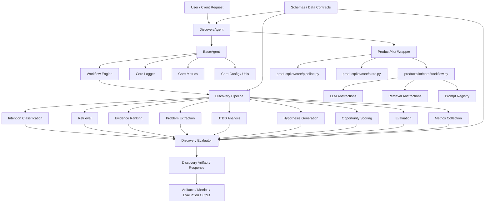

# ProductPilot Architecture Diagram

This diagram reflects the current implementation structure in the repository, including the discovery workflow, shared core services, and the productpilot package wrapper.

## Implementation Mapping

- Discovery workflow: [discovery/orchestrator.py](../discovery/orchestrator.py)
- Base agent lifecycle: [core/agent.py](../core/agent.py)
- Discovery agent entrypoint: [discovery/agent.py](../discovery/agent.py)
- ProductPilot wrapper: [productpilot/agents/discovery_agent.py](../productpilot/agents/discovery_agent.py)
- Workflow engine: [productpilot/core/workflow.py](../productpilot/core/workflow.py)
- Schemas: [schemas](../schemas)
